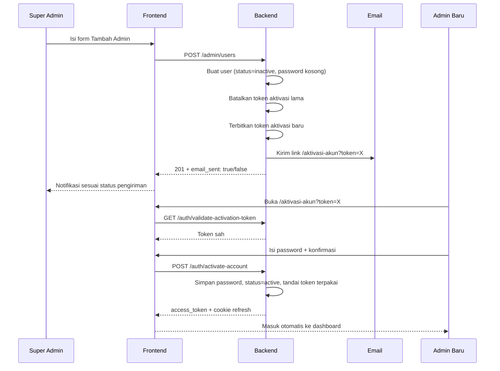

# Design — Perbaikan Manajemen Admin & Aktivasi Akun

## Overview

Dokumen ini merancang perbaikan dua area yang saling terkait: **aktivasi akun admin baru** (yang saat ini rusak total sehingga admin baru tidak bisa login) dan **manajemen admin** di panel super admin.

Ruang lingkup mencakup backend (modul `user`, modul `auth`, template email) dan frontend (halaman aktivasi baru, halaman Manajemen Admin, service layer).

Semua temuan di dokumen ini berasal dari pembacaan kode, bukan asumsi. Kondisi data runtime tidak diverifikasi karena akses terminal tidak tersedia saat investigasi.

---

## 1. Analisis Akar Masalah

### 1.1 Penyebab utama: token aktivasi dikirim ke halaman yang salah

Rantai kegagalannya:

| Langkah | Lokasi | Perilaku |
|---|---|---|
| 1 | `user_service.go` → `sendActivationEmail()` | Menyimpan token via `SaveAuthToken(..., "activation", ...)` → masuk tabel `activation_tokens` |
| 2 | `user_service.go` → `sendActivationEmail()` | Membuat link `%s/reset-password?token=%s` |
| 3 | `App.jsx` | Route `/reset-password` → komponen `ResetPassword` |
| 4 | `authService.js` | Halaman memanggil `GET /auth/validate-reset-token` |
| 5 | `auth_service.go` → `ValidateResetToken()` | Memanggil `FindAuthToken(ctx, token, repository.TokenResetPassword)` |
| 6 | `auth_repo.go` → `FindAuthToken()` | `case "reset_password"` membaca tabel `password_reset_tokens` |

Token tersimpan di `activation_tokens`, tetapi dicari di `password_reset_tokens`. Pencarian **selalu gagal**, sehingga halaman selalu menampilkan "Token reset password tidak valid atau telah kedaluwarsa".

Konsekuensi: admin baru tidak pernah dapat menyetel password. Karena `auth_service.go` menolak login saat `user.Status != "active"` (kode `AUTH_ACCOUNT_INACTIVE`) dan `Create()` membuat user dengan `Status = "inactive"` tanpa password, akun baru **tidak akan pernah bisa masuk**.

### 1.2 Endpoint yang benar sudah ada tetapi tidak terpakai

Backend sudah menyediakan jalur aktivasi yang benar, lengkap dengan rate limit:

- `GET /auth/validate-activation-token` → `FindAuthToken(ctx, token, "activation")`
- `POST /auth/activate-account` → `ActivateAccount(ctx, token, password)`

Tidak ada satu pun yang dipanggil frontend. Tidak ada route maupun halaman aktivasi di `App.jsx` — hanya `/login` dan `/reset-password`.

### 1.3 Duplikasi jalur aktivasi

Terdapat dua implementasi `ActivateAccount` yang terpisah:

- `auth/service/auth_service.go` → dipakai `POST /auth/activate-account` (punya rate limit `activateLimit`)
- `user/service/user_service.go` → dipakai `POST /users/:id/activate` (tanpa rate limit)

Route `POST /users/:id/activate` memiliki parameter `:id` yang **tidak pernah dibaca** handler-nya — handler hanya mengambil `token` dan `password` dari body. Parameter itu menyesatkan dan dua implementasi berisiko berkembang tidak sinkron.

### 1.4 Kopling tersembunyi: satu tipe token untuk dua tujuan

Tipe token `"activation"` saat ini dipakai untuk **dua** keperluan berbeda:

- Aktivasi akun baru → user menyetel password pertama
- Verifikasi perubahan email (`UpdateProfile()` memanggil `sendActivationEmail()`) → user hanya perlu mengonfirmasi email, **tidak** menyetel password

Karena keduanya memakai fungsi pembuat link yang sama, mengubah tujuan link aktivasi akan otomatis salah-arah untuk verifikasi email. Ini harus ditangani bersamaan, bukan setelahnya.

Catatan penyimpanan token: `SaveAuthToken()` memetakan tipe ke tabel terpisah lewat `switch` (`reset_password` → `password_reset_tokens`, `activation` → `activation_tokens`) dan menolak tipe lain dengan error `unknown auth token type`. Menambah tipe token baru berarti menambah tabel dan model baru.

### 1.5 Bug lain yang terkonfirmasi

| # | Bug | Bukti |
|---|---|---|
| B1 | Kegagalan kirim email ditelan | `Create()`: `if err := s.sendActivationEmail(...); err != nil { _ = err }` — komentar bilang "log saja" tetapi tidak ada logging |
| B2 | Mailer nil dianggap sukses | `sendActivationEmail()`: `if s.mailer == nil { return nil }` |
| B3 | Pesan UI menyesatkan | Form: "Kredensial login (email & password default) akan dikirim"; toast: "Kredensial login dikirim ke email admin!" — padahal yang dikirim link aktivasi |
| B4 | `ToggleStatus` mengabaikan body | Frontend kirim `{status:'inactive'}`; handler memanggil `s.ToggleStatus(ctx, id)` yang membalik status saat ini tanpa membaca body |
| B5 | Tidak ada fitur edit user | `PUT /admin/users/:id` dan `GET /admin/users/:id` ada di backend; `userService.js` tidak punya method-nya |
| B6 | Tab "Menunggu Aktivasi" mencampur dua kondisi | Tab memakai `status='inactive'`, padahal status itu mencakup akun belum-aktivasi (tanpa password) **dan** akun sengaja dinonaktifkan (punya password) |
| B7 | Audit log mencatat aktor salah | `ActorID: &user.ID` diisi user target; karena non-nil, logika pengisian aktor dari context di `s.log()` tidak pernah berjalan |
| B8 | Handler tanpa route | `BulkResendNotification`, `GetDependencyInfo`, `CheckUnique` tidak terdaftar di `routes.go` |
| B9 | Proteksi role hardcode ID | `ToggleStatus` dan `BulkDelete` memakai `user.RoleID == 1` dan `GetAll(ctx, 1)`, sementara middleware memakai nama role `super_admin` |
| B10 | Branding email salah | `account_inactive.html` dan `otp_notification.html` masih memakai merek "SchoolPay"; `render.go` juga menyebutnya di komentar paket |
| B11 | Token lama tetap sah | Setiap pemanggilan `sendActivationEmail()` menerbitkan token baru tanpa membatalkan yang lama; semua link tetap valid hingga 72 jam |

---

## 2. Alur Target

### 2.1 Aktivasi akun baru



### 2.2 Perbandingan singkat

| Aspek | Sekarang | Target |
|---|---|---|
| Tujuan link email | `/reset-password` | `/aktivasi-akun` |
| Endpoint validasi | `validate-reset-token` (tipe salah) | `validate-activation-token` |
| Endpoint submit | tidak pernah tercapai | `POST /auth/activate-account` |
| Hasil akhir | token selalu ditolak | password tersetel, status aktif, masuk otomatis |
| Kegagalan email | tersembunyi | dilaporkan ke admin |

---

## 3. Desain Perubahan

### 3.1 Alur aktivasi akun

**Backend — `user/service/user_service.go`**

`sendActivationEmail()` diubah:

- Link menjadi `%s/aktivasi-akun?token=%s`
- Sebelum menerbitkan token baru, batalkan seluruh token aktivasi milik user tersebut yang belum terpakai
- Jika `s.mailer == nil`, kembalikan error eksplisit (bukan `nil`) agar pemanggil tahu email tidak terkirim

**Backend — konsolidasi jalur aktivasi**

- Hapus route `POST /users/:id/activate` dan handler `UserHandler.Activate`
- Jalur resmi tunggal: `POST /auth/activate-account` (sudah punya rate limit dan endpoint validasi pendamping)
- Metode `userService.ActivateAccount()` dihapus jika tidak ada pemakai lain; jika masih dipakai internal, sisakan satu implementasi dan panggil dari modul auth

Alasan memilih jalur `auth`: alur berbasis token milik domain autentikasi, sudah dilindungi rate limit (`activateLimit`, `validateActivateLimit`), dan sudah punya pasangan endpoint validasi.

**Frontend — halaman baru**

- `frontend/src/pages/ActivateAccount.jsx`
- Route `/aktivasi-akun` di `App.jsx` (publik, tanpa `ProtectedRoute`)
- Strukturnya mengikuti pola `ResetPassword.jsx` yang sudah ada agar konsisten

Status halaman:

| Status | Kondisi | Tampilan |
|---|---|---|
| `validating` | Sedang memanggil validasi token | Indikator memuat |
| `invalid` | Token tidak ada / ditolak server | Pesan token tidak berlaku + tautan ke `/login` |
| `form` | Token sah | Input password + konfirmasi password |
| `submitting` | Sedang mengirim | Tombol nonaktif + indikator |
| `success` | Aktivasi berhasil | Pesan sukses lalu arahkan ke dashboard |

**Frontend — `services/authService.js`**

Tambah dua method:

- `validateActivationToken(token)` → `GET /auth/validate-activation-token?token=...`
- `activateAccount(token, password)` → `POST /auth/activate-account`

Aturan password mengikuti backend (`binding:"required,min=6"`): minimal 6 karakter, ditambah validasi kecocokan konfirmasi di frontend.

### 3.2 Pemisahan aktivasi akun dan verifikasi email

Dua keperluan dipisahkan agar tidak saling merusak:

| Keperluan | Pemicu | Tujuan link | Tindakan user |
|---|---|---|---|
| Aktivasi akun | `Create()` dan `ResendNotification()` | `/aktivasi-akun` | Menyetel password pertama |
| Verifikasi email | `UpdateProfile()` saat email berubah | `/verifikasi-email` | Hanya mengonfirmasi email |

Implementasi:

- Pecah `sendActivationEmail()` menjadi dua fungsi: `sendActivationEmail()` dan `sendEmailVerification()`
- Keduanya tetap memakai tabel `activation_tokens` (tipe `"activation"`) sehingga tidak perlu tabel baru — yang membedakan adalah **tujuan link** dan **endpoint yang memprosesnya**
- Tambah halaman `frontend/src/pages/VerifyEmail.jsx` + route `/verifikasi-email`

Batasan yang perlu disadari: `POST /profile/verify-email` memakai `requireAuth` dan memeriksa `tokenUserID != userID`. Artinya tautan verifikasi email **harus dibuka pada browser yang sesinya masih aktif**. Halaman `/verifikasi-email` menangani kasus belum login dengan mengarahkan ke `/login` sambil menyimpan token, lalu melanjutkan verifikasi setelah masuk.

### 3.3 Observabilitas pengiriman email

Pembuatan user tetap berhasil walaupun email gagal (agar admin bisa mengirim ulang), tetapi kegagalan tidak lagi disembunyikan.

**Backend**

- `Create()` menangkap hasil `sendActivationEmail()` dan meneruskannya ke response
- Tambah logging server-side yang sebenarnya pada jalur gagal, menggantikan `_ = err`
- Response `POST /admin/users` diperluas: `email_sent` (bool) dan `email_error` (string, opsional)

**Frontend**

Notifikasi disesuaikan dengan hasil nyata:

| Kondisi | Notifikasi |
|---|---|
| `email_sent: true` | "Admin dibuat. Tautan aktivasi dikirim ke {email}." |
| `email_sent: false` | Peringatan: "Admin dibuat, tetapi email aktivasi gagal dikirim. Gunakan Kirim Ulang Undangan." |

**Perbaikan teks yang menyesatkan (B3)**

- Keterangan form diubah menjadi: "Tautan aktivasi akan dikirim ke email ini. Admin baru menyetel passwordnya sendiri."
- Label tombol submit diubah dari "Buat & Kirim Kredensial" menjadi "Buat & Kirim Undangan"

**Pengetatan `ResendNotification()`**

Tolak pengiriman ulang jika akun sudah memiliki password, dengan pesan bahwa akun sudah aktif. Aturan ini sudah diterapkan di `BulkResendNotification()` lewat `userHasPassword()`, sehingga cukup disamakan.

### 3.4 Set status eksplisit

**Backend**

- Ganti `ToggleStatus(ctx, id)` menjadi `SetStatus(ctx, id, status)` yang idempoten
- Handler membaca body `{ "status": "active" | "inactive" }` dan memvalidasinya
- DTO baru: `UserSetStatusReq{ Status string \`json:"status" binding:"required,oneof=active inactive"\` }`

Penjagaan yang dipertahankan dan diperbaiki:

| Aturan | Sekarang | Target |
|---|---|---|
| Tidak boleh menonaktifkan akun sendiri | Ada | Dipertahankan |
| Tidak boleh menonaktifkan super admin aktif terakhir | Ada, memakai `RoleID == 1` | Dipertahankan, memakai nama role |
| Mengaktifkan akun tanpa password | Diizinkan (menghasilkan status rancu) | Ditolak, arahkan admin memakai Kirim Ulang Undangan |

Aturan terakhir mencegah keadaan "aktif tetapi tidak punya password", yang lolos pemeriksaan status di login namun tetap gagal karena password tidak cocok.

### 3.5 Edit pengguna

**Frontend — `services/userService.js`**

Tambah method yang endpoint-nya sudah tersedia:

- `detail(id)` → `GET /admin/users/:id`
- `update(id, payload)` → `PUT /admin/users/:id`
- `bulkResendActivation(ids)` → `POST /admin/users/bulk-resend-activation`

**Frontend — `UsersAdmin.jsx`**

- Modal form dipakai ulang untuk dua mode: `create` dan `edit`
- Mode `edit` memuat data via `detail(id)` sebelum membuka modal
- Field yang dapat diubah: nama, email, role

Catatan kontrak: `UserUpdateReq` mewajibkan `Name`, `Email`, dan `RoleID` (bukan partial update), jadi payload edit harus mengirim ketiganya secara lengkap.

Penjagaan tambahan: akun bertanda `is_system` atau berrole `super_admin` tidak dapat diedit dari UI, dan admin tidak dapat mengubah role akunnya sendiri untuk mencegah salah-kunci hak akses.

### 3.6 Model status dan tab

Empat keadaan diturunkan dari data, bukan dari satu kolom:

| Keadaan | Definisi | Tab |
|---|---|---|
| Aktif | `status = 'active'` | Aktif |
| Menunggu Aktivasi | `status = 'inactive'` dan password kosong | Menunggu Aktivasi |
| Nonaktif | `status = 'inactive'` dan password terisi | Nonaktif |
| Terhapus | `deleted_at` terisi | Terhapus |

**Backend — repository**

`FindPaginated()` memperluas penanganan parameter `status`:

| Nilai `status` | Kondisi query |
|---|---|
| `active` | `status = 'active'` |
| `pending` | `status = 'inactive' AND (password IS NULL OR password = '')` |
| `inactive` | `status = 'inactive' AND password <> ''` |
| kosong | tanpa filter status |

Pemfilteran dilakukan di server agar jumlah total dan penomoran halaman tetap akurat.

**Frontend**

Empat tab menggantikan tiga tab sekarang. Aksi per tab:

| Tab | Aksi tersedia |
|---|---|
| Aktif | Edit, Nonaktifkan, Hapus |
| Menunggu Aktivasi | Kirim Ulang Undangan, Kirim Ulang Massal, Edit, Hapus |
| Nonaktif | Aktifkan, Edit, Hapus |
| Terhapus | Pulihkan, Pulihkan Massal |

Ini menyelesaikan jalan buntu sekarang: akun nonaktif kini punya aksi "Aktifkan", dan akun yang sengaja dinonaktifkan tidak lagi muncul di tab aktivasi.

### 3.7 Perbaikan aktor pada audit log

Akar masalah: `s.log()` sudah punya mekanisme pengisian aktor dari context

```
if input.ActorID == nil && userID > 0 { input.ActorID = &userID }
```

tetapi setiap pemanggil mengisi `ActorID` secara eksplisit dengan user target, sehingga cabang tersebut tidak pernah tereksekusi.

Perbaikan dibedakan berdasarkan siapa pelaku sebenarnya:

| Operasi | Pelaku | Perlakuan |
|---|---|---|
| `users.create`, `users.update`, `users.delete`, `users.set_status`, `users.restore`, `users.resend_activation`, `users.bulk_*` | Super admin | Hapus penetapan `ActorID/ActorName/ActorRole` eksplisit; biarkan diisi dari context |
| `users.activate` | User itu sendiri (endpoint publik, tanpa context auth) | Tetap tetapkan eksplisit ke user tersebut |
| `users.change_password`, `users.update_profile`, `users.verify_email` | User itu sendiri | Boleh tetap eksplisit; nilainya sama dengan context |

Kolom `EntityID` dan `EntityLabel` tetap menunjuk user target — bagian ini sudah benar.

### 3.8 Konsistensi proteksi role

Ganti pemeriksaan berbasis ID role menjadi berbasis nama role di `user_handler.go`:

- `user.RoleID == 1` → periksa `user.RoleName == "super_admin"` atau tanda `is_system`
- `h.s.GetAll(c.Request.Context(), 1)` → pencarian super admin aktif berdasarkan nama role

Alasan: middleware otorisasi sudah memakai nama role (`RoleMiddleware("super_admin")`), dan seeder menormalkan nama role ke bentuk snake_case. Bergantung pada ID numerik membuat proteksi rapuh bila urutan seed berubah.

### 3.9 Kebersihan route

| Handler | Kondisi | Keputusan |
|---|---|---|
| `BulkResendNotification` | Ada, tanpa route | Daftarkan `POST /admin/users/bulk-resend-activation` — dipakai aksi massal tab Menunggu Aktivasi |
| `CheckUnique` | Ada, tanpa route | Daftarkan `GET /admin/users/check-unique` — untuk validasi email langsung di form |
| `GetDependencyInfo` | Ada, tanpa route, mengembalikan `has_child: false` hardcode | Hapus handler beserta method service-nya |
| `UserHandler.Activate` | Duplikat jalur aktivasi | Hapus bersama route `POST /users/:id/activate` |

### 3.10 Branding template email

Bersihkan sisa merek proyek lain agar email tidak dikirim dengan identitas salah:

- `template_message/email/account_inactive.html` — judul, badge header, isi teks, dan footer
- `template_message/email/otp_notification.html` — judul, badge header, isi teks
- `template_message/email/render.go` — komentar paket

Nama situs sebaiknya diambil dari konfigurasi aplikasi (`APP_NAME`) atau tabel `settings`, bukan ditulis tetap di template, supaya perubahan nama organisasi tidak menuntut penyuntingan template.

---

## 4. Ringkasan Perubahan Kontrak API

| Endpoint | Sekarang | Target |
|---|---|---|
| `POST /admin/users` | Response tanpa status email | Tambah `email_sent`, `email_error` |
| `PUT /admin/users/:id/status` | Body diabaikan, status dibalik | Baca `{status}`, set eksplisit, idempoten |
| `POST /admin/users/:id/resend-activation` | Kirim tanpa pemeriksaan | Tolak bila akun sudah punya password |
| `POST /admin/users/bulk-resend-activation` | Belum terdaftar | Didaftarkan |
| `GET /admin/users/check-unique` | Belum terdaftar | Didaftarkan |
| `GET /admin/users` | `status` menerima `active`/`inactive` | Menerima juga `pending` |
| `POST /users/:id/activate` | Duplikat, `:id` tidak terpakai | Dihapus |
| `POST /auth/activate-account` | Ada, tidak dipakai frontend | Menjadi jalur resmi |
| `GET /auth/validate-activation-token` | Ada, tidak dipakai frontend | Menjadi jalur resmi |

---

## 5. Perubahan Data dan Model

Tidak ada perubahan skema tabel yang diperlukan. Kolom yang sudah ada mencukupi:

- `users.status` — membedakan aktif dan nonaktif
- `users.password` — kosong berarti belum pernah aktivasi
- `users.deleted_at` — soft delete
- `activation_tokens` — token aktivasi dan verifikasi email (dengan `used_at` dan `expires_at`)

Penambahan pada layer repository, bukan skema:

- `InvalidateUserAuthTokens(ctx, userID, tokenType)` — menandai token lama sebagai terpakai sebelum menerbitkan yang baru (B11)
- Perluasan kondisi `status` di `FindPaginated()` (bagian 3.6)

---

## 6. Penanganan Error

| Situasi | Kode | Perilaku |
|---|---|---|
| Token aktivasi salah atau kedaluwarsa | `AUTH_TOKEN_INVALID_OR_EXPIRED` | Halaman aktivasi menampilkan pesan token tidak berlaku dan tautan ke login |
| SMTP gagal saat pembuatan user | — | User tetap dibuat; response `email_sent: false`; admin diberi peringatan |
| SMTP gagal saat kirim ulang | `EMAIL_SEND_FAILED` | Kirim ulang gagal dengan pesan jelas; tidak ada notifikasi sukses palsu |
| Mailer tidak dikonfigurasi | `EMAIL_NOT_CONFIGURED` | Error eksplisit, bukan sukses semu |
| Kirim ulang ke akun yang sudah punya password | `ACCOUNT_ALREADY_ACTIVE` | Ditolak dengan penjelasan |
| Mengaktifkan akun tanpa password | `ACCOUNT_HAS_NO_PASSWORD` | Ditolak, arahkan ke Kirim Ulang Undangan |
| Menonaktifkan akun sendiri | `UNAUTHORIZED_ACTION` | Ditolak (perilaku sekarang dipertahankan) |
| Menonaktifkan super admin aktif terakhir | `UNAUTHORIZED_ACTION` | Ditolak (perilaku sekarang dipertahankan) |
| Rate limit aktivasi terlampaui | `RATE_LIMITED` | Halaman menampilkan hitung mundur, memakai `useRateLimitCooldown` yang sudah ada |

---

## 7. Strategi Pengujian

**Verifikasi build**

- Backend: `go build ./...`
- Frontend: `npm run build` dan `npm run lint`

**Alur yang perlu diuji manual**

1. Buat admin baru → email diterima → buka tautan → setel password → masuk otomatis ke dashboard
2. Buka tautan aktivasi yang sama untuk kedua kali → ditolak karena token sudah terpakai
3. Kirim ulang undangan → hanya tautan terbaru yang sah, tautan sebelumnya ditolak
4. Kirim ulang undangan ke akun yang sudah aktif → ditolak dengan pesan jelas
5. Nonaktifkan akun → akun berpindah ke tab Nonaktif → login ditolak dengan `AUTH_ACCOUNT_INACTIVE`
6. Aktifkan kembali akun dari tab Nonaktif → login berhasil
7. Coba aktifkan akun di tab Menunggu Aktivasi → ditolak, diarahkan memakai Kirim Ulang Undangan
8. Edit nama, email, dan role admin → perubahan tersimpan dan tampil di tabel
9. Ubah email pada Profil sendiri → tautan verifikasi mengarah ke `/verifikasi-email`, bukan ke halaman aktivasi
10. Hapus lalu pulihkan akun → status aktif atau nonaktif sebelumnya tetap terjaga
11. Matikan konfigurasi SMTP → buat admin baru → user tetap dibuat, peringatan email gagal muncul
12. Periksa Activity Log → pelaku tercatat sebagai super admin yang melakukan aksi, bukan user target

**Pemeriksaan audit log**

Setelah setiap operasi manajemen admin, pastikan kolom pelaku pada Activity Log menampilkan super admin yang menjalankan aksi, dan kolom entitas menampilkan user yang menjadi sasaran.

---

## 8. Urutan Implementasi yang Disarankan

Dikerjakan bertahap agar setiap langkah dapat diverifikasi sendiri:

| Tahap | Fokus | Alasan urutan |
|---|---|---|
| 1 | Perbaiki tautan aktivasi, pemisahan verifikasi email, pembatalan token lama | Memulihkan fungsi paling kritis: admin baru bisa masuk |
| 2 | Halaman `/aktivasi-akun` dan `/verifikasi-email` beserta method `authService` | Melengkapi alur tahap 1 dari sisi antarmuka |
| 3 | Observabilitas email dan pembenahan teks yang menyesalkan | Menghilangkan notifikasi sukses palsu |
| 4 | Set status eksplisit dan konsistensi proteksi role | Memungkinkan aktivasi ulang akun nonaktif |
| 5 | Model empat status, tab baru, dan filter server-side | Memperjelas keadaan akun |
| 6 | Fitur edit pengguna | Melengkapi kemampuan pengelolaan |
| 7 | Perbaikan aktor audit log | Memulihkan ketepatan jejak audit |
| 8 | Kebersihan route dan branding template email | Merapikan sisa masalah |

Tahap 1 dan 2 saling bergantung dan sebaiknya diselesaikan sebagai satu kesatuan sebelum diuji.
